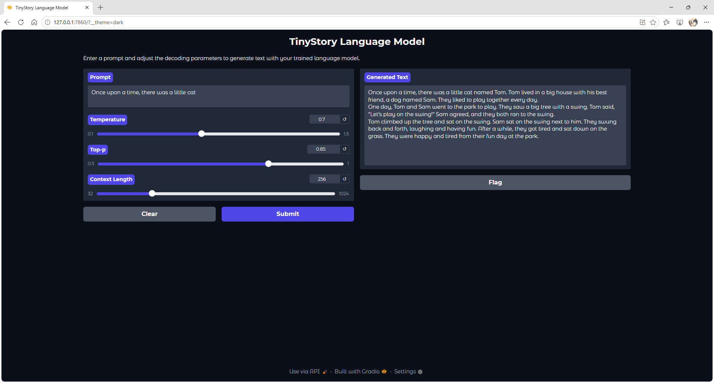

# Language Modeling From Scratch

A comprehensive implementation of modern language models built entirely from scratch, demonstrating deep understanding of transformer architectures, optimization techniques, distributed systems, and reinforcement learning alignment.

## Project Overview

This repository showcases end-to-end implementation of language modeling techniques, from foundational components to advanced alignment methods. Built as part of Stanford CS336 course sequence, this project demonstrates production-level engineering with rigorous testing and benchmarking.

**Key Technologies:** PyTorch, CUDA, Triton Kernels, Data Filter, vLLM, Pre-training, Post-training(SFTHF, GRPO/RLHF)

---

## Key Achievements

### Complete Transformer Implementation (Assignment 1)
- **Built GPT-style transformer from scratch** with custom implementations of all core components
- Created **BPE tokenizer** matching GPT-2's tokenization scheme
- Implemented **RoPE (Rotary Positional Embeddings)** for improved positional encoding
- Developed **SwiGLU activation** and **RMSNorm** for stable training
- Trained on **TinyStory dataset** and **OpenWebText dataset** achieving competitive perplexity scores
- Custom **AdamW optimizer** with cosine annealing learning rate scheduling

**Technical Highlights:**
- Multi-head self-attention with causal masking
- Gradient clipping for training stability
- Memory-efficient data loading with memory-mapped files

[View Model Architecture](assignment1/cs336_basics/model.py) | [Tokenizer Implementation](assignment1/cs336_basics/tokenizer.py) | [Optimizer](assignment1/cs336_basics/optimizer.py) | [NN units](assignment1/cs336_basics/nn_utils.py) | [Training Pipeline](assignment1/cs336_basics/training_together.py)

#### Usage for Assignment 1
- To train the model from scratch on TinyStories:  
  You need to download the dataset into [assignment1/data](assignment1/data/)  
  You can download dataset at [TinyStoriesV2-GPT4-train.txt](https://huggingface.co/datasets/roneneldan/TinyStories/resolve/main/TinyStoriesV2-GPT4-train.txt) | [TinyStoriesV2-GPT4-valid.txt](https://huggingface.co/datasets/roneneldan/TinyStories/resolve/main/TinyStoriesV2-GPT4-valid.txt)  
  Alternatively, use the provided [script](assignment1/cs336_basics/run_scripts/download_datasets.py) to download them automatically:

```bash
cd assignment1
python cs336_basics/run_scripts/download_datasets.py
```
- Once you have the datasets you can begin training your TinyStories model:  
  First, train the BPE tokenizer using [train_bpe_run.py](assignment1/cs336_basics/run_scripts/train_bpe_run.py)  

```bash
cd assignment1
python cs336_basics/run_scripts/train_bpe_run.py
```

  Then, tokenize your text datasets into token ids with [pretokenization.py](assignment1/cs336_basics/run_scripts/pretokenization.py)  

```bash
cd assignment1
python cs336_basics/run_scripts/pretokenization.py
```

  Finally, train your model with [training_run.py](assignment1/cs336_basics/run_scripts/training_run.py)

```bash
cd assignment1
python cs336_basics/run_scripts/training_run.py
```

- After model training completes:  
  You can run the inference using the trained model with [inference_run.py](assignment1/cs336_basics/run_scripts/inference_run.py)

```bash
cd assignment1
python cs336_basics/run_scripts/inference_run.py
```

#### Example Inference Outputs
After training, the model generates coherent stories from TinyStories. Here are sample outputs:


*Prompt: "There was a little boy named Tom"*


*Prompt: "Once upon a time, there was a little cat"*
