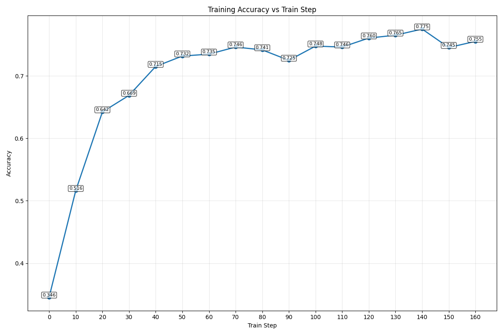

# Language Modeling From Scratch

A comprehensive implementation of modern language models built entirely from scratch, demonstrating deep understanding of transformer architectures, optimization techniques, distributed systems, and reinforcement learning alignment.

## Project Overview

This repository showcases end-to-end implementation of language modeling techniques, from foundational components to advanced alignment methods. Built as part of Stanford CS336 course sequence, this project demonstrates production-level engineering with rigorous testing and benchmarking.

**Key Technologies:** PyTorch, CUDA, Triton Kernels, Data Filter, vLLM, Pre-training, Post-training(SFTHF, GRPO/RLHF)

---

## Key Achievements

### Complete Transformer Implementation (Assignment 1)
- **Built GPT-style transformer from scratch** with custom implementations of all core components
- Created **BPE tokenizer** matching GPT-2's tokenization scheme
- Implemented **RoPE (Rotary Positional Embeddings)** for improved positional encoding
- Developed **SwiGLU activation** and **RMSNorm** for stable training
- Trained on **TinyStory dataset** and **OpenWebText dataset** achieving competitive perplexity scores
- Custom **AdamW optimizer** with cosine annealing learning rate scheduling

**Technical Highlights:**
- Multi-head self-attention with causal masking
- Gradient clipping for training stability
- Memory-efficient data loading with memory-mapped files

[View Model Architecture](assignment1/cs336_basics/model.py) | [Tokenizer Implementation](assignment1/cs336_basics/tokenizer.py) | [Optimizer](assignment1/cs336_basics/optimizer.py) | [NN units](assignment1/cs336_basics/nn_utils.py) | [Training Pipeline](assignment1/cs336_basics/training_together.py)

---

### Systems Optimization & Distributed Training (Assignment 2)
- Implemented **Flash Attention** for faster training speed
- Built **Distributed Data Parallel (DDP)** training from scratch
- Developed **optimizer state sharding** for memory-efficient large-scale training
- Created **Triton kernels** for falsh attention

**Performance Improvements:**
- Flash Attention: ~2-3x speedup on long sequences
- DDP: for ~1-2x faster training speed

[Flash Attention](assignment2/cs336_systems/flash_attention.py) | [DDP Implementation](assignment2/cs336_systems/naive_ddp.py)

---

### Data Pipeline & Quality Filtering (Assignment 4)
- Built scalable **data preprocessing pipeline** for web-scale corpora
- Implemented **quality classification** using FastText models
- Developed **deduplication algorithms** (MinHash + LSH)
- Created filters for toxicity, PII detection, and language identification
- Processed CommonCrawl data into clean C4-like datasets

**Data Processing Features:**
- HTML extraction and text cleaning
- Multi-language support with langid
- High-quality vs low-quality data separation

[Quality Filtering](assignment4/cs336_data/text_filter.py) | [Train Data Filter](assignment4/cs336_data/data_classifier_training.py) 

---

### SFT & RLHF & Alignment (Assignment 5)
- Built **Supervised Fine-Tuning (SFT)** pipeline
- Implemented **Expert Iteration** for SFT
- Implemented **GRPO (Group Relative Policy Optimization)** for RLHF
- Integrated **vLLM** for high-throughput inference during training
- Evaluated on **GSM8K mathematical reasoning benchmark**

**Alignment Techniques:**
- Post-Training Qwen2.5 Math 1.5B with R1_zero_prompt
- On-policy and off-policy GRPO variants
- Clipped and unclipped policy gradient methods

**Results:** Achieved significant improvements on mathematical reasoning tasks through RL fine-tuning

 [GRPO Implementation](assignment5/cs336_alignment/reinforcement_learning.py) | [SFT Pipeline](assignment5/cs336_alignment/supervised_fine_tuning.py) | [Expert Iteration](assignment5/cs336_alignment/expert_iteration_experiment.py) | [Helper Methods](assignment5/cs336_alignment/helper_methods.py)

---
## Usages and examples
### Transformer Implementation (Assignment 1)
#### Usage for Assignment 1
- To train the model from scratch on TinyStories:  
  You need to download the dataset into [assignment1/data](assignment1/data/)  
  You can download dataset at [TinyStoriesV2-GPT4-train.txt](https://huggingface.co/datasets/roneneldan/TinyStories/resolve/main/TinyStoriesV2-GPT4-train.txt) | [TinyStoriesV2-GPT4-valid.txt](https://huggingface.co/datasets/roneneldan/TinyStories/resolve/main/TinyStoriesV2-GPT4-valid.txt)  
  Alternatively, use the provided [script](assignment1/cs336_basics/run_scripts/download_datasets.py) to download them automatically:

```bash
cd assignment1
python cs336_basics/run_scripts/download_datasets.py
```
- Once you have the datasets you can begin training your TinyStories model:  
  First, train the BPE tokenizer using [train_bpe_run.py](assignment1/cs336_basics/run_scripts/train_bpe_run.py)  

```bash
cd assignment1
python cs336_basics/run_scripts/train_bpe_run.py
```

  Then, tokenize your text datasets into token ids with [pretokenization.py](assignment1/cs336_basics/run_scripts/pretokenization.py)  

```bash
cd assignment1
python cs336_basics/run_scripts/pretokenization.py
```

  Finally, train your model with [training_run.py](assignment1/cs336_basics/run_scripts/training_run.py)

```bash
cd assignment1
python cs336_basics/run_scripts/training_run.py
```

- After model training completes:  
  You can run the inference using the trained model with [inference_run.py](assignment1/cs336_basics/run_scripts/inference_run.py)

```bash
cd assignment1
python cs336_basics/run_scripts/inference_run.py
```

#### Example Inference Outputs
After training, the model generates coherent stories from TinyStories. Here are sample outputs:


*Prompt: "There was a little boy named Tom"*


*Prompt: "Once upon a time, there was a little cat"

### Systems Optimization & Distributed Training (Assignment 2)
#### Benchmark on Naive attention and falsh attention.
- In [attention_bechmark.csv](assets/attention_bechmark.csv) You could find that flash attention could be about 2-3 times faster than naive attention, and could be memroy friendly

### Data Pipeline & Quality Filtering (Assignment 4)
#### Usage of Assignment 4
- Before the next step you will need to download raw datasets and models in [hugging_face_link](https://huggingface.co/datasets/BocchiSKK/data/tree/main) and put those directories in [data](assignment4/data)
- To train our data filter, first use [high_quality_data_download.py](assignment4/cs336_data/high_quality_data_download.py) to download high-quality English text from Wikipedia linked pages. Then use [low_quality_data.py](assignment4/cs336_data/low_quality_data.py) to extract raw English text from Common Crawl (CC) datasets. Once you have both high-quality and low-quality datasets, train the text filter using [data_classifier_training.py](assignment4/cs336_data/data_classifier_training.py)

```bash
cd assignment4
python cs336_data/high_quality_data_download.py
python cs336_data/low_quality_data.py  
python cs336_data/data_classifier_traning.py
```

### SFT & RLHF & Alignment (Assignment 5)
#### Usage of Assignment 5
- For this usage and examples I used [GSM8K dataset](https://huggingface.co/datasets/openai/gsm8k/tree/main) and I already putted it in [GSM8K](assignment5/data/datasets/GSM8K/) you don't need to download it for twice, if you are going to use other datasets you will need to change the function **generate_gsm8k_test_prompts_answers** in [helper_methods.py](assignment5/cs336_alignment/helper_methods.py) to fit your datasets.

- In [supervised_fine_tuning.py](assignment5/cs336_alignment/supervised_fine_tuning.py), you can SFTHF qwen2.5_math_1.5B with GSM8K.
```bash
cd assignment5
python cs336_alignment/supervised_fine_tuning.py
```
- In [expert_iteration_experiment.py](assignment5/cs336_alignment/expert_iteration_experiment.py), you can run expert iteration on qwen2.5_math_1.5B with GSM8K
```bash
cd assignment5
python cs336_alignment/expert_iteration_experiment.py
```
- In [post_training.py](assignment5/cs336_alignment/post_training.py), you will first run a SFTHF first then apply GRPO on qwen2.5_math_1.5B with GSM8K to get a better performance.
```bash
cd assignment5
python cs336_alignment/post_training.py
```

#### Examples
- For my post_training loop on GSM8K. I get a best test accurcy on **77.48%**

